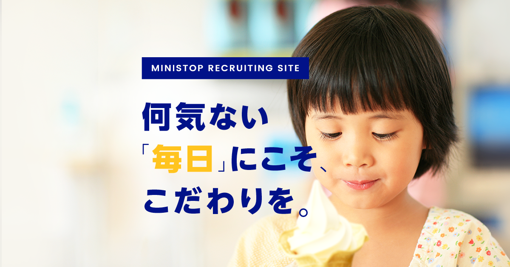

# ministop_recruit_2018 README

https://ryosuketter.github.io/port_ministop_recruit_2018/dest/index.html

## Production Time

2017-05-08 〜 2017-07-31

## CSS設計は基本、Enduring CSSを採用
本案件では、最低限の共通部分は抽象化や共通化させているが、それ以外はeCSSで、なるべく「分けて」管理することで運用の負荷を下げるというアプローチを取ります。

Enduring CSSとは
* 公式ドキュメント（英語）：http://ecss.io/
* ドキュメント（日本語）：https://html5experts.jp/takazudo/21946/

## 対応ブラウザ
PC
* IE = 11以上
* firefox, Safari, Chrome = 最新版
SP
* iOS = 8以上
* Android(chrome & firefox)
	
## vendorに入れるファイル
animete.cssなど、DLして使うcssファイルは、（src/assets/scss/vendor）に、scssにして入れれば
dest以下のstyle.cssに統一コンパイルされる。JSは別ファイルとして、コンパイルされる。
